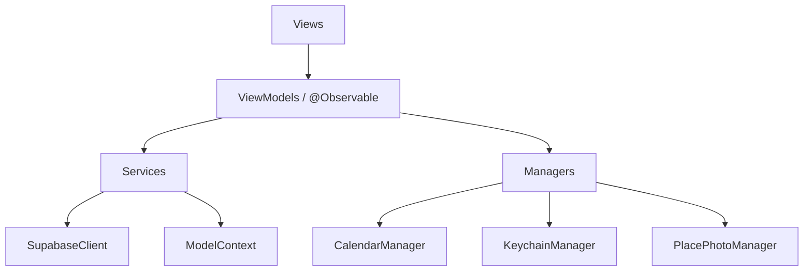

# TourLeaderAssistant — Code Review 報告

> **專案概述**：一款領隊助手 iOS App，使用 SwiftUI + SwiftData 本機儲存 + Supabase 雲端同步，管理團體行程、帳務、日誌、地點庫等功能。  
> **審核範圍**：全部原始碼（Models、Managers、Extensions、Views）、設定檔、版本控制。  
> **審核日期**：2026-04-09

---

## 📊 總覽

| 分類 | 發現數 |
|---|---|
| 🔴 嚴重（安全性 / 資料風險）| 3 |
| 🟠 中等（架構 / 品質）| 8 |
| 🟡 輕微（建議改善）| 10 |
| 🟢 優點 | 6 |

---

## 🟢 優點

在深入問題之前，先肯定幾個做得很好的方面：

1. **清楚的目錄結構**：Models / Managers / Extensions / Views 分層清楚，子目錄依功能區分（Team、Finance、Place、Journal 等），新功能很容易定位。
2. **xcconfig 分離環境設定**：Debug / Release 各有獨立 xcconfig，並透過 `.gitignore` 排除 `*.xcconfig`，API Key 不會進入版本控制。
3. **Supabase 同步的衝突策略清楚**：`needsSync` 旗標 + `updatedAt` 時間戳比對的「本機優先 + 時間戳覆蓋」策略明確，同步行為可預測。
4. **照片管理完善**：`PlacePhotoManager` 壓縮 → 本機存檔 → 雲端上傳 → 刪除旗標同步的完整生命週期管理很好。
5. **Keychain 裝置識別**：使用 `KeychainManager` 儲存 device UUID 並搭配 `kSecAttrAccessibleAfterFirstUnlock`，是正確的做法。
6. **UI 設計一致性**：自訂配色系統（AppAccent、AppCard、AppBackground）、卡片式設計、StatusBadge、WorkspaceCard 等元件可重複使用，視覺體驗統一。

---

## 🔴 嚴重問題

### 1. SQL Injection 風險 — 搜尋查詢未轉義

> [!CAUTION]
> 使用者輸入直接內嵌到 Supabase `.or()` 查詢字串中，有 SQL Injection 風險。

**受影響檔案**：
- [SupabaseManager.swift](file:///Users/bryan/Documents/TourLeaderAssistant/TourLeaderAssistant/Managers/SupabaseManager.swift#L398)
- [SupabaseManager+Search.swift](file:///Users/bryan/Documents/TourLeaderAssistant/TourLeaderAssistant/Extensions/SupabaseManager+Search.swift#L188)

```swift
// ⚠️ 危險：query 來自使用者輸入，直接拼接
.or("name_en.ilike.%\(query)%,name_zh.ilike.%\(query)%")
```

如果使用者輸入惡意字串（例如包含 `,` 或 `.` 的 PostgREST 操作符），可能改變查詢語意。雖然 Supabase 內部有一定的查詢解析保護，但**不應信任使用者輸入**。

**建議修正**：
```swift
// 對特殊字元進行轉義
private func sanitizeQuery(_ input: String) -> String {
    input.replacingOccurrences(of: "%", with: "\\%")
         .replacingOccurrences(of: "_", with: "\\_")
         .replacingOccurrences(of: ",", with: "")
         .replacingOccurrences(of: ".", with: " ")
}
```

或者改用 Supabase 的 RPC 函式搭配 `text search` 功能。

---

### 2. `deleteTeam` 未清理關聯資料（孤兒資料）

> [!CAUTION]
> 刪除團體時只刪除 `Team` 本身，`TourFund`、`Expense`、`Income`、`Journal`、`TourDocument` 等透過 `teamID` 關聯的資料全部成為孤兒資料。

**受影響檔案**：[TeamListView.swift:L167-170](file:///Users/bryan/Documents/TourLeaderAssistant/TourLeaderAssistant/Views/Team/TeamListView.swift#L167-L170)

```swift
private func deleteTeam(_ team: Team) {
    CalendarManager.shared.removeEvent(for: team)
    modelContext.delete(team)
    // ❌ 沒有刪除 Expense、Income、TourFund、Journal、TourDocument
}
```

**原因分析**：這些 Model 使用 `teamID: UUID` 而非 SwiftData `@Relationship`，所以 cascade delete 無法自動生效。

**建議修正**：
```swift
private func deleteTeam(_ team: Team) {
    CalendarManager.shared.removeEvent(for: team)
    
    let teamID = team.id
    
    // 清理所有關聯資料
    let expenseDesc = FetchDescriptor<Expense>(predicate: #Predicate { $0.teamID == teamID })
    (try? modelContext.fetch(expenseDesc))?.forEach { modelContext.delete($0) }
    
    let incomeDesc = FetchDescriptor<Income>(predicate: #Predicate { $0.teamID == teamID })
    (try? modelContext.fetch(incomeDesc))?.forEach { modelContext.delete($0) }
    
    let fundDesc = FetchDescriptor<TourFund>(predicate: #Predicate { $0.teamID == teamID })
    (try? modelContext.fetch(fundDesc))?.forEach { modelContext.delete($0) }
    
    let journalDesc = FetchDescriptor<Journal>(predicate: #Predicate { $0.teamID == teamID })
    (try? modelContext.fetch(journalDesc))?.forEach { modelContext.delete($0) }
    
    let docDesc = FetchDescriptor<TourDocument>(predicate: #Predicate { $0.teamID == teamID })
    (try? modelContext.fetch(docDesc))?.forEach { modelContext.delete($0) }
    
    modelContext.delete(team)
}
```

> [!TIP]
> 長期來說，建議改用 SwiftData `@Relationship(deleteRule: .cascade)` 取代 `teamID: UUID` 這種手動關聯，讓框架自動處理級聯刪除。

---

### 3. 照片刪除邏輯有 `file_name` 碰撞風險

> [!WARNING]
> `deleteRemotePhoto` 用 `file_name` 作為刪除條件，但如果兩個不同地點有相同 `fileName`（UUID 生成機率極低但理論上可能），會誤刪其他地點的照片記錄。

**受影響檔案**：[SupabaseManager+Photos.swift:L164-168](file:///Users/bryan/Documents/TourLeaderAssistant/TourLeaderAssistant/Extensions/SupabaseManager+Photos.swift#L164-L168)

```swift
try await client
    .from("place_photos")
    .delete()
    .eq("file_name", value: fileName) // ⚠️ 應加上 place_id 條件
    .execute()
```

**建議修正**：加上 `place_id` 雙重篩選條件：
```swift
try await client
    .from("place_photos")
    .delete()
    .eq("file_name", value: fileName)
    .eq("place_id", value: placeRemoteID.uuidString)
    .execute()
```

---

## 🟠 中等問題

### 4. `SupabaseManager` 過於龐大（God Object）

[SupabaseManager.swift](file:///Users/bryan/Documents/TourLeaderAssistant/TourLeaderAssistant/Managers/SupabaseManager.swift) 主檔 **915 行**，加上兩個 Extension 檔案合計約 **1,920 行**。涵蓋了：
- 連線測試
- 國家城市同步
- 地點上傳（Hotel / Restaurant / Attraction 各一套）
- 搜尋合併
- 照片同步
- 所有 Payload / Remote 資料結構

**問題**：職責過多，Codable struct 混雜在 Manager 裡，難以維護、測試和理解。

**建議**：
1. 把所有 Payload 和 Remote struct 抽到 `Models/RemoteModels.swift`
2. 拆分服務層：
   - `PlaceSyncService` → 地點上傳 / 合併
   - `CitySyncService` → 國家城市同步
   - `PhotoSyncService` → 照片同步

---

### 5. 大量重複的三段式模式（Hotel / Restaurant / Attraction）

上傳、合併、搜尋、下載、更新等操作，每種地點類型幾乎都是 copy-paste 的代碼，只差欄位不同。

**重複程式碼統計**：
| 操作 | 重複次數 | 估計重複行數 |
|------|----------|-------------|
| upload | ×3 | ~120 行 |
| merge | ×3 | ~150 行 |
| searchRemote | ×3 | ~60 行 |
| download | ×3 | ~120 行 |
| refreshLocal | ×3 | ~120 行 |
| fetchRemotePreview | ×3 | ~90 行 |
| localPreviews | ×3 | ~60 行 |

**建議**：引入 Protocol 抽象：
```swift
protocol SyncablePlace {
    associatedtype RemoteModel: Codable
    associatedtype PayloadModel: Encodable
    
    var remoteID: UUID? { get set }
    var needsSync: Bool { get set }
    var city: City? { get }
    
    static var tableName: String { get }
    func toPayload(cityRemoteID: UUID) -> PayloadModel
    mutating func update(from remote: RemoteModel)
}
```

---

### 6. `@Query` 拿全表再客戶端篩選效能差

多處 View 用 `@Query private var allExpenses: [Expense]` 抓取**全部資料**後再 `.filter { $0.teamID == team.id }`。

**受影響檔案**：
- [TeamWorkspaceView.swift:L14](file:///Users/bryan/Documents/TourLeaderAssistant/TourLeaderAssistant/Views/Team/TeamWorkspaceView.swift#L14)（`@Query private var allExpenses: [Expense]`）
- [ExpenseListView.swift:L8-9](file:///Users/bryan/Documents/TourLeaderAssistant/TourLeaderAssistant/Views/Finance/ExpenseListView.swift#L8-L9)
- [StatsView.swift:L5-6](file:///Users/bryan/Documents/TourLeaderAssistant/TourLeaderAssistant/Views/Stats/StatsView.swift#L5-L6)

**問題**：當資料量增大時，每次 View 更新都要遍歷全部資料。

**建議**：使用 `init` 注入動態 predicate 建立有篩選條件的 `@Query`，或在 `init` 中設定 `FetchDescriptor`。

---

### 7. 本機搜尋效能低落

[SupabaseManager+Search.swift:L87-160](file:///Users/bryan/Documents/TourLeaderAssistant/TourLeaderAssistant/Extensions/SupabaseManager+Search.swift#L87-L160) 中的 `localHotelPreviews` / `localRestaurantPreviews` / `localAttractionPreviews` 每次搜尋都 fetch 全部資料然後做 `.filter`，且 **三者同步阻塞主執行緒**。

```swift
func localHotelPreviews(query: String, context: ModelContext) -> [PlaceSearchPreview] {
    let descriptor = FetchDescriptor<PlaceHotel>()  // ⚠️ 無 predicate，拿全部
    guard let hotels = try? context.fetch(descriptor) else { return [] }
    return hotels.filter { ... }  // 記憶體內篩選
}
```

**建議**：使用 `FetchDescriptor` 的 `predicate` 在資料庫層級過濾，或至少做 `fetchLimit` 限制。

---

### 8. `HotelSupportingTypes` 使用 `@unchecked Sendable`

[HotelSuportingTypes.swift](file:///Users/bryan/Documents/TourLeaderAssistant/TourLeaderAssistant/Models/HotelSuportingTypes.swift)（注意檔名有 typo：`Suporting`  →  `Supporting`）

```swift
struct FloorsAndHours: Codable, @unchecked Sendable { ... }
struct HotelWifi: Codable, @unchecked Sendable { ... }
```

這些 struct **所有屬性都是 `String` 或 `[String]`**，本身就是值類型，天生滿足 `Sendable`。`@unchecked Sendable` 是不必要的，應該去掉：

```swift
struct FloorsAndHours: Codable, Sendable { ... }
```

---

### 9. `CalendarManager` 缺乏錯誤處理

[CalendarManager.swift:L54](file:///Users/bryan/Documents/TourLeaderAssistant/TourLeaderAssistant/Managers/CalendarManager.swift#L54)：

```swift
func removeEvent(for team: Team) {
    guard let eventID = team.calendarEventID,
          let event = store.event(withIdentifier: eventID) else { return }
    try? store.remove(event, span: .thisEvent)  // ⚠️ 失敗時靜默忽略
    team.calendarEventID = nil  // ❌ 無論成功失敗都清除 ID
}
```

如果 `remove` 失敗但 `calendarEventID` 已被清除，下次無法重試刪除。

---

### 10. 未使用 Swift Concurrency 的 isolation 保護

`SupabaseManager` 標記為 `@MainActor`，但 extension 中的方法（`SupabaseManager+Search.swift`、`SupabaseManager+Photos.swift`）繼承了 `@MainActor`，意味著所有同步操作（包括大量資料處理）都會在主執行緒上執行。

長時間的 `refreshAllLocalPlaces` 或 `uploadPendingPlaces` 可能導致 UI 卡頓。

**建議**：將純資料處理部分搬到 `nonisolated` 或使用 `Task.detached` 在背景執行。

---

### 11. `PlacePhotoManager` 放在 Views 目錄下

[PlacePhotoManager.swift](file:///Users/bryan/Documents/TourLeaderAssistant/TourLeaderAssistant/Views/Place/PlacePhotoManager.swift) 是一個 Manager 類別，但放在 `Views/Place/` 目錄下。

**建議**：移到 `Managers/` 目錄，與其他 Manager 保持一致。

---

## 🟡 輕微問題

### 12. `DateFormatter` 頻繁建立

多處在 computed property 或迴圈中重複建立 `DateFormatter`：

```swift
// TeamWorkspaceView.swift:L130
infoItem(icon: "calendar", text: {
    let f = DateFormatter()  // ⚠️ 每次渲染都建立
    f.dateFormat = "MM/dd"
    return "..."
}())
```

`DateFormatter` 建立成本高，應該緩存為 `static` 常數。

**建議**：
```swift
extension DateFormatter {
    static let shortMonthDay: DateFormatter = {
        let f = DateFormatter()
        f.dateFormat = "MM/dd"
        return f
    }()
}
```

---

### 13. SettingsView 中有 Placeholder 未替換

[SettingsView.swift:L73, L82](file:///Users/bryan/Documents/TourLeaderAssistant/TourLeaderAssistant/Views/Settings/SettingsView.swift#L73)

```swift
// ⚠️ "idYOUR_APP_ID" 和 "your@email.com" 是 Placeholder
URL(string: "itms-apps://itunes.apple.com/app/idYOUR_APP_ID?action=write-review")
URL(string: "mailto:your@email.com?subject=領隊助手意見回饋")
```

上架前務必替換真實 App ID 和聯繫信箱。

---

### 14. `TourLeaderAssistantApp.init` 中的 `Task` 沒有被管理

[TourLeaderAssistantApp.swift:L30-33](file:///Users/bryan/Documents/TourLeaderAssistant/TourLeaderAssistant/TourLeaderAssistantApp.swift#L30-L33)

```swift
Task {
    let ok = await SupabaseManager.shared.testConnection()
    print("Supabase 連線：\(ok ? "成功" : "失敗")")
}    }  // ← 額外的 } 格式問題
```

1. `Task` 結果沒有被 stored，如果 App 生命週期提前結束會被取消
2. 連線失敗只有 `print`，使用者無法知道雲端功能是否可用
3. 右大括號格式有問題（`}    }`）

---

### 15. SeedData 使用 Tuple 而非 Struct

[SeedData.swift:L36](file:///Users/bryan/Documents/TourLeaderAssistant/TourLeaderAssistant/SeedData.swift#L36)

```swift
static let countries: [(String, String, String, String, String)] = [...]
```

5 個 `String` 的 Tuple 不具可讀性，需要靠註解才能知道每個位置代表什麼。

**建議**：定義一個 struct：
```swift
struct CountrySeed {
    let nameZH: String
    let nameEN: String
    let code: String
    let phoneCode: String
    let currencyCode: String
}
```

---

### 16. Model 中 `id` 應使用 `@Attribute(.unique)`

所有 Model 都手動設定 `var id: UUID`，但沒有標注 `@Attribute(.unique)`。雖然 UUID() 碰撞機率極低，但加上 unique 標記是正確的做法，避免意外重複。

---

### 17. `convertedAmount` 計算邏輯可能除以零

[Expense.swift:L45](file:///Users/bryan/Documents/TourLeaderAssistant/TourLeaderAssistant/Models/Expense.swift#L45)

```swift
self.convertedAmount = (amount * quantity) / exchangeRate
```

如果 `exchangeRate` 為 0，會導致除以零。應加保護：
```swift
self.convertedAmount = exchangeRate == 0 ? 0 : (amount * quantity) / exchangeRate
```

---

### 18. 缺少 `.gitignore` 對 `.DS_Store` 的排除

當前 `.gitignore` 只有 `*.xcconfig`，但專案中到處都有 `.DS_Store` 檔案被 tracked。

**建議加入**：
```
.DS_Store
*.xcconfig
```

---

### 19. `findOrCreateCity` 方法被重複實作

`SupabaseManager.swift` 中有 `findOrCreateCity` (L558)，`SupabaseManager+Search.swift` 中有幾乎相同的 `findOrCreateCityInExtension` (L627)。還有 `anyCodableToJsonString` / `jsonStringFromAnyCodable` 也是同樣邏輯的重複。

**建議**：把這些輔助方法統一放到 `SupabaseManager` 本體，`internal` access level 讓 extension 共用。

---

### 20. 沒有使用 `Localizable.strings`

所有 UI 字串都是硬編碼的中文。如果未來有國際化需求，改造成本很高。

**建議**：重要的 UI 字串使用 `NSLocalizedString` 或 SwiftUI 的 `LocalizedStringKey`。即使目前只有中文版，也建議為未來留好擴展空間。

---

### 21. `View+DynamicTypeSize` 與 `ContentView` 重複邏輯

[View+DynamicTypeSize.swift](file:///Users/bryan/Documents/TourLeaderAssistant/TourLeaderAssistant/Extensions/View+DynamicTypeSize.swift) 和 [ContentView.swift:L15-22](file:///Users/bryan/Documents/TourLeaderAssistant/TourLeaderAssistant/ContentView.swift#L15-L22) 有完全相同的 switch 邏輯。

**建議**：在 `ContentView` 中直接使用 `.appDynamicTypeSize(textSizePreference)` extension。

---

## 📐 架構建議

基於以上發現，以下是整體架構的改善建議：

### 改用 SwiftData Relationship

目前 `Team` ↔ `Expense`/`Income`/`Journal`/`TourFund`/`TourDocument` 使用 `teamID: UUID` 手動關聯，這導致：
- 級聯刪除需手動處理
- `@Query` 無法利用 relationship 自動篩選
- 資料完整性沒有框架保護

**建議改為**：
```swift
@Model
class Team {
    @Relationship(deleteRule: .cascade, inverse: \Expense.team)
    var expenses: [Expense] = []
    // ...
}

@Model
class Expense {
    var team: Team?
    // ...
}
```

### 引入 Repository / Service 層



目前 View 直接呼叫 `SupabaseManager`，建議在中間加一層 Service，讓 View 層更乾淨、更容易測試。

---

## 🔧 修正優先順序

| 優先順序 | 問題 | 預估工時 |
|----------|------|---------|
| P0 | #1 SQL Injection 轉義 | 30 分鐘 |
| P0 | #2 deleteTeam 清理關聯資料 | 1 小時 |
| P0 | #3 照片刪除加上 place_id 條件 | 15 分鐘 |
| P1 | #13 Settings Placeholder 替換 | 5 分鐘 |
| P1 | #17 exchangeRate 除以零保護 | 5 分鐘 |
| P1 | #18 .gitignore 加 .DS_Store | 5 分鐘 |
| P2 | #4 SupabaseManager 拆分 | 4 小時 |
| P2 | #5 三段式重複代碼重構 | 8 小時 |
| P2 | #6-7 @Query 效能優化 | 2 小時 |
| P3 | 其他輕微問題 | 各 15-30 分鐘 |

---

需要我針對任何一個問題開始進行修正嗎？
